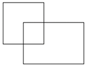

# **Detection Algorithms**

## **Congratulations! You passed!**

### **Grade received** 90%

### **Latest Submission Grade** 90%

### **To pass** 80% or higher

---

1. You are building a 3-class object classification and localization algorithm. The classes are: pedestrian (c=1), car (c=2), motorcycle (c=3). What should $y$ be for the image below? Remember that “?” means “don’t care”, which means that the neural network loss function won’t care what the neural network gives for that component of the output. Recall $y = [p_{c}, b_{x}, b_{y}, b_{h}, b_{w}, c_1, c_2, c_3]$

    

    https://www.pexels.com/es-es/foto/mujer-vestida-con-falda-azul-y-blanca-caminando-cerca-de-la-hierba-verde-durante-el-dia-144474/

   - [ ] $y = [1, 0.66, 0.5, 0.75, 0.16, 0, 0, 0]$
   - [x] $y = [1, 0.66, 0.5, 0.75, 0.16, 1, 0, 0]$
   - [ ] $y = [1, ?, ?, ?, ?, 1, ?, ?]$
   - [ ] $y = [1, 0.66, 0.5, 0.16, 0.75, 1, 0, 0]$

    > ✔️ <spane style="color: green;">**Correct** Correct. $p_{c} = 1$ since there is a pedestrian in the picture. We can see that $b_x, b_y$ as percentages of the image are approximately correct as well $b_h, b_w$, and the value of $c_1 = 1$ for a pedstrian.

---

2. You are working on a factory automation task. Your system will see a can of soft-drink coming down a conveyor belt, and you want it to take a picture and decide whether (i) there is a soft-drink can in the image, and if so (ii) its bounding box. Since the soft-drink can is round, the bounding box is always square, and the soft drink can always appear the same size in the image. There is at most one soft drink can in each image. Here’re some typical images in your training set:

    

    To solve this task it is necessary to divide the task into two: 1. Construct a system to detect if a can is present or not. 2. Construct a system that calculates the bounding box of the can when present. Which one of the following do you agree with the most?

    - [ ] An end-to-end solution is always superior to a two-step system.
    - [ ] We can't solve the task as an image classification with a localization problem since all the bounding boxes have the same dimensions.
    - [ ] The two-step system is always a better option compared to an end-to-end solution.
    - [x] We can approach the task as an image classification with a localization problem.

    > ✔️ <spane style="color: green;">**Correct** Correct. We can use a network to combine the two tasks similar to that described in the lectures.

---

3. If you build a neural network that inputs a picture of a person’s face and outputs N landmarks on the face (assume the input image always contains exactly one face), how many output units will the network have?

    - [ ] $N^2$
    - [ ] $N$
    - [ ] $3N$
    - [x] $2N$

    > ✔️ <spane style="color: green;">**Correct** Correct.

---

4. You are working to create an object detection system, like the ones described in the lectures, to locate cats in a room. To have more data with which to train, you search on the internet and find a large number of cat photos.

    Which of the following is true about the system?

    - [ ] We can't use internet images because it changes the distribution of the dataset.
    - [x] We can't add the internet images unless they have bounding boxes.
    - [ ] We should add the internet images (without the presence of bounding boxes in them) to the train set.
    - [ ] We should use the internet images in the dev and test set since we don't have bounding boxes.

    > ✔️ **Correct** Correct. As this is a localization model, we also need the coordinates of the bounding boxes, not just the images.

---

5. What is the IoU between these two boxes? The upper-left box is 2x2, and the lower-right box is 2x3. The overlapping region is 1x1.

    

    - [ ] $\frac{1}{10}$
    - [x] $\frac{1}{9}$
    - [ ] $\frac{1}{6}$
    - [ ] None of the above

    > ✔️ <spane style="color: green;">**Correct** Correct. The left box's area is 4 while the right box 's is 6. Their intersection's area is 1. So their union's area is 4 + 6 - 1 = 9 which leads to an intersection over union of 1/9.

---

6. Suppose you run non-max suppression on the predicted boxes below. The parameters you use for non-max suppression are that boxes with probability $\leq 0.4$ are discarded, and the IoU threshold for deciding if two boxes overlap is $0.5$.

    

    Notice that there are three bounding boxes for cars. After running non-max suppression, only the bounding box of the car with 0.73 is kept from the three bounding boxes for cars. True/False? Choose the best answer.

    - [ ] False. All the cars are eliminated since there is a pedestrian with a higher score of 0.98.
    - [x] False. Two bounding boxes corresponding to cars are left since their IoU is zero.
    - [ ] True. The non-maximum suppression eliminates the bounding boxes with scores lower than the ones of the maximum.

    > ✖️ **Incorrect**. Incorrect. One of the bounding boxes for cars is eliminated because it has a lower score and an IoU higher than 0.5.

---

7. If we use anchor boxes in YOLO we no longer need the coordinates of the bounding box $b_{x}, b_{y}, b_{h}, b_{w}$ since they are given by the cell position of the grid and the anchor box selection. True/False?

    - [x] False
    - [ ] True

    > ✔️ <spane style="color: green;">**Correct** Correct. We use the grid and anchor boxes to improve the capabilities of the algorithm to localize and detect objects, for example, two different objects that intersect, but we still use the bounding box coordinates.

---

8. Semantic segmentation can only be applied to classify pixels of images in a binary way as 1 or 0, according to whether they belong to a certain class or not. True/False?

    - [x] False
    - [ ] True

    > ✔️ <spane style="color: green;">**Correct** Correct. The same ideas used for multi-class classification can be applied to semantic segmentation.

---

9. Using the concept of Transpose Convolution, fill in the values of X, Y and Z below.

    (padding = 1, stride = 2)

    Input: 2x2

    | 1 | 2 |
    | - | - |
    | 3 | 4 |

    Filter: 3x3

    | 1 | 1 | 1 |
    | - | - | - |
    | 0 | 0 | 0 |
    | -1 | -1 | -1 |

    Result: 6x6

    | . |   |   |   |   |   |
    | - | - | - | - | - | - |
    |   | 0 | 0 | 0 | X |   |
    |   | Y | 4 | 2 | 2 |   |
    |   | 0 | 0 | 0 | 0 |   |
    |   | -3| Z | -4| -4|   |
    | . |   |   |   |   |   |

    - [ ] X = 0, Y = 2, Z = -1
    - [x] X = 0, Y = 2, Z = -7
    - [ ] X = 0, Y = -1, Z = -4
    - [ ] X = 0, Y = -1, Z = -7

    > ✔️ <spane style="color: green;">**Correct**

---

10. When using the U-Net architecture with an input $h\times w\times c$, where $c$ denotes the number of channels, the output will always have the shape $h\times w\times c$. True/False?

    - [ ] True
    - [x] False

    > ✔️ <spane style="color: green;">**Correct** Correct. The output of the U-Net architecture can be $h\times w\times k$ where $k$ is the number of classes. The number of channels doesn't have to match between input and output.
