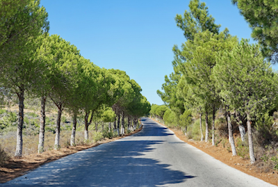
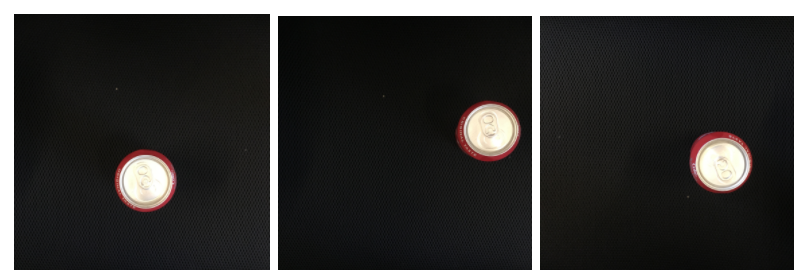
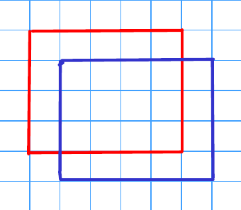
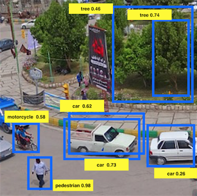

# Detection Algorithms

1. You are building a 3-class object classification and localization algorithm. The classes are: pedestrian (c=1), car (c=2), motorcycle (c=3). What should $y$ be for the image below? Remember that “?” means “don’t care”, which means that the neural network loss function won’t care what the neural network gives for that component of the output. Recall $y=[p_c,b_x,b_y,b_h,b_w,c_1,c_2,c_3]$

   > **$y = [0, ?, ?, ?, ?, ?, ?, ?]$**
---
2. You are working on a factory automation task. Your system will see a can of soft-drink coming down a conveyor belt, and you want it to take a picture and decide whether (i) there is a soft-drink can in the image, and if so (ii) its bounding box. Since the soft-drink can is round, the bounding box is always square, and the soft drink can always appear the same size in the image. There is at most one soft drink can in each image. Here are some typical images in your training set:

What are the most appropriate (lowest number of) output units for your neural network?

    > **Logistic Unit, $b_x$ and $b_y$**
---
3. When building a neural network that inputs a picture of a person's face and outputs N landmarks on the face (assume that the input image contains exactly one face), we need two coordinates for each landmark, thus we need 2N output units. True/False?

    > **True**
---
4. You are working to create an object detection system, like the ones described in the lectures, to locate cats in a room. To have more data with which to train, you search on the internet and find a large number of cat photos.  
Which of the following is true about the system?

    >**We can't add the internet images unless they have bounding boxes**
---
5. What is the IoU between the red box and the blue box in the following figure? Assume that all the squares have the same measurements. 

    > **$\frac{3}{7}$**
---
6. Suppose you run non-max suppression on the predicted boxes below. The parameters you use for non-max suppression are that boxes with probability $\leq 0.4$ are discarded, and the IoU threshold for deciding if two boxes overlap is $0.5$.
  
Notice that there are three bounding boxes for cars. After running non-max suppression, only the bounding box of the car with 0.73 is kept from the three bounding boxes for cars. True/False? Choose the best answer.

    > **False. Two bounding boxes corresponding to cars are left since their IoU is zero.**
---
7. If we use anchor boxes in YOLO we no longer need the coordinates of the bounding box $b_x,b_y,b_h,b_w$​ since they are given by the cell position of the grid and the anchor box selection. True/False?

    > **False**
---
8. Semantic segmentation can only be applied to classify pixels of images in a binary way as 1 or 0, according to whether they belong to a certain class or not. True/False?

    > **False**
---
9. Using the concept of Transpose Convolution, fill in the values of **X**, **Y** and **Z** below.  
(padding = 1, stride = 2)  
    Input: $2\times 2$
    | 1     | 3     |
    | :---: | :---: |
    | 2     | 4     |

    Filter: $3\times 3$
    | 1     | 0     | 1     |
    | :---: | :---: | :---: |
    | 0     | 0     | 0     |
    | 1     | 0     | 1     |

    Result: $6\times 6$
    | .  |   |   |   |   |   |
    |:-: |:-:|:-:|:-:|:-:|:-:|
    |    | 0 | 0 | 0 | 0 |   |
    |    | 0 | x | 0 | 7 |   |
    |    | 0 | 0 | 0 | y |   |
    |    | 0 | z | 0 | 4 |   |
    | .  |   |   |   |   |   |

    > **$x = 10, y = 0, z = 6$**
---
10. When using the U-Net architecture with an input $h\times w\times c$, where $c$ denotes the number of channels, the output will always have the shape $h\times w\times c$. True/False?

    > **False**
