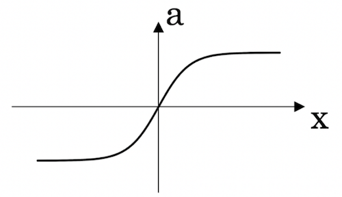
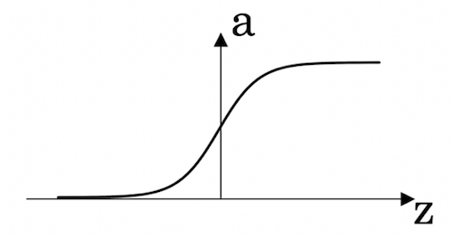
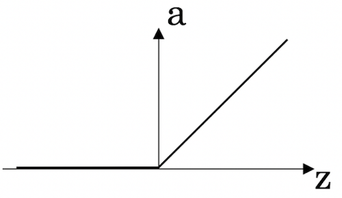
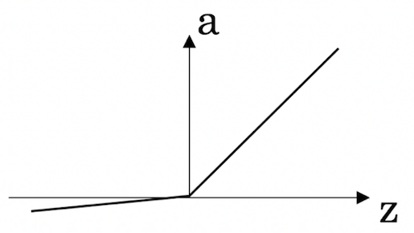
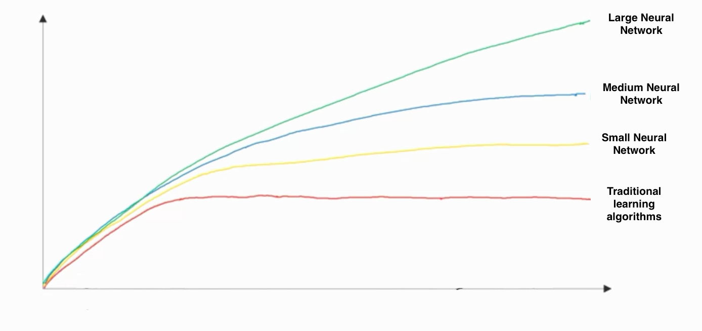

# Introduction to Deep Learning

1. Which of the following best describes the role of AI in the expression "an AI-powered society"?

   > **AI helps to create a more efficient way of producing energy to power industries and personal devices**

---

2. Which of the following play a major role to achieve a very high level of performance with Deep Learning algorithms?

    > **Better designed features to use**

    > **Large amounts of data**

---

3. Recall this diagram of iterating over different ML ideas. Which of the statements below are true? (Check all that apply.)

    > **Improvements in the GPU/CPU hardware enable the discovery of better Deep Learning algorithms.**

    > **Better algorithms can speed up the iterative process by reducing the necessary computation time**

---

4. Neural networks are good at figuring out functions relating an input $x$ to an output $y$ given enough examples. True/False?

    > **True**

---

5. Which one of these plots represents a ReLU activation function?

  > 

   > **Figure 3 is the answer**
---

6. Which of the following are examples of unstructured data? Choose all that apply.

    > **Sound files for speech recognition**

    > **Images for bird recognition**

    > **Text describing size and number of pages of books**

---

7. A demographic dataset with statistics on different cities' population, GDP per capita, and economic growth is an example of “unstructured” data because it contains data coming from different sources. True/False?

    > **False**

---

8. RNNs (Recurrent Neural Networks) are good for data with a temporal component. True/False?

    > **True**

---

9. In this diagram which we hand-drew in the lecture, what do the horizontal axis (x-axis) and vertical axis (y-axis) represent?

   > **x-axis is the amount of data**

   > **y-axis (vertical axis) is the performance of the algorithm**

---

10.  Assuming the trends described in the previous question's figure are accurate (and hoping you got the axis labels right), which of the following are true? (Check all that apply.)

   > **Increasing the training set size generally does not hurt an algorithm's performance, and it may help significantly**

   > **Increasing the size of neural network generally does not hurt an algorithm's performance, and it may help significantly**
