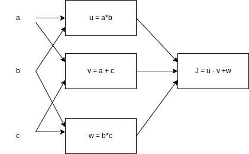

# **Neural Network Basics**

## **Congratulations! You passed!**

### **Grade received** 100%

### **Latest Submission Grade** 100%

### **To pass** 80% or higher

---

1. What does a neuron compute?

    - [ ] A neuron computes the mean of all features before applying the output to an activation function
    - [ ] A neuron computes an activation function followed by a linear function $z = Wx+b$
    - [ ] A neuron computes a function g that scales the input x linearly $(Wx + b)$
    - [x] A neuron computes a linear function $z = Wx + b$ followed by an activation function
    > <spane style="color: green;">**Correct** Correct, we generally say that the output of a neuron is a = g(Wx + b) where g is the activation function (sigmoid, tanh, ReLU, ...).

---

2. Which of these is the "Logistic Loss"?

    - [ ] $\mathcal{L}^{(i)}(\hat{y}^{(i)}, y^{(i)}) = |0, y^{(i)} - \hat{y}^{(i)}|^{2}$
    - [ ] $\mathcal{L}^{(i)}(\hat{y}^{(i)}, y^{(i)}) = |0, y^{(i)} - \hat{y}^{(i)}|$
    - [ ] $\mathcal{L}^{(i)}(\hat{y}^{(i)}, y^{(i)}) = max(0, y^{(i)} - \hat{y}^{(i)})$
    - [x] $\mathcal{L}^{(i)}(\hat{y}^{(i)}, y^{(i)}) = -(y^{(i)} \log(\hat{y}^{(i)}) + (1-y^{(i)})\log(1-\hat{y}^{(i)}))$
    > <spane style="color: green;">**Correct** Correct, this is the logistic loss you've seen in lecture!

---

1. Suppose img is a (32,32,3) array, representing a 32x32 image with 3 color channels red, green and blue. How do you reshape this into a column vector $x$?

    - [ ] x = img.reshape((1, 32\*32, 3))
    - [ ] x = img.reshape((3, 32\*32))
    - [x] x = img.reshape((32\*32\*3, 1))
    - [ ] x = img.reshape((32\*32, 3))
    > <spane style="color: green;">**Correct**

---

4. Consider the following random arrays $a$ and $b$, and $c$:

   $a = np.random.randn(3, 3) ~\sharp a.shape = (3, 3)$

   $b = np.random.randn(2, 1) ~\sharp b.shape = (2, 1)$

   $c = a + b$

   What will be the shape of $c$?

    - [ ] c.shape = (2, 1)
    - [ ] c.shape = (3, 3)
    - [ ] c.shape = (2, 3, 3)
    - [x] The computation cannot happen becausse it is not possible to broadcast more than one dimension
    > <spane style="color: green;">**Correct** Yes. It is not possible to broadcast together a and b. In this case there is no way to generate copies of one of the arrays to match the size of the other.

---

5. Consider the following random arrays $a$ and $b$:

   $a = np.random.randn(1, 3) ~\sharp a.shape = (1, 3)$

   $b = np.random.randn(3, 3) ~\sharp b.shape = (3, 3)$

   $c = a * b$

   What will be the shape of $c$?

   - [ ] The computation cannot happen because it is not possible to broadcast more than one dimension.
   - [ ] The computation cannot happen because the sizes don't match.
   - [ ] c.shape = (1,3)
   - [x] c.shape = (3,3)
    > <spane style="color: green;">**Correct** Yes. Broadcasting allows row a to be multiplied element-wise with each row of b to from c.

---

6. Suppose you have $n_{x}$ input features per example. Recall that $X = [x^{(1)}~x^{(2)}~\cdots~x^{(m)}]$ What is the dimension of $X$?

    - [x] $(n_x, m)$
    - [ ] $(m, n_x)$
    - [ ] $(m, 1)$
    - [ ] $(1, m)$
    > <spane style="color: green;">**Correct**

---

1. Consider the following array:

   $a = np.array([[2, 1], [1, 3]])$

   What is the result of $a*a$ ?

    - [x] $\left \lparen \matrix {4 & 1 \cr 1 & 9} \right \rparen$
    - [ ] $\left \lparen \matrix {4 & 2 \cr 2 & 6} \right \rparen$
    - [ ] The computation cannot happen because the sizes don't match. It's going to be an "Error"!
    - [ ] $\left \lparen \matrix {4 & 2 \cr 2 & 6} \right \rparen$
    > <spane style="color: green;">**Correct** Yes, recall that * indicates element-wise multiplication.

---

8. Consider the following code sinppet:

   $a.shape = (3, 4)$

   $b.shape = (4, 1)$

   for i in range(3):

   for j in range(4):

   c[i][j] = a[i][j] + b[j]

    How do you vectorize this?

    - [ ] c = a.T + b.T
    - [x] c = a + b.T
    - [ ] c = a + b
    - [ ] c = a.T + b
    > <spane style="color: green;">**Correct**

---

9. Consider the code sinppet:

   $a.shape = (3, 3)$

   $b.shape = (3, 3)$

   $c = a\*\*2 + b.T\*\*2$

   Which of the following gives an equivalent output for $c$?

   - [x] for i in range(3): 
   for j in range(3): 
   c[i][j] = a[i][j]\*\*2 + b[j][i]\*\*2
   - [ ] The computation cannot happen because the sizes don't match. It's going to be an "Error"!
   - [ ] for i in range(3): 
   for j in range(3): 
   c[i][j] = a[i][j]\*\*2 + b[i][j]\*\*2
   - [ ] for i in range(3): 
   c[i] = a[i]\*\*2 + b[i]\*\*2
    > <spane style="color: green;">**Correct** Yes. This code squares each entry of a and adds it to the transpose of b square.

---

10. Consider the following computational graph.

    

    What is the output of $J$?

    - [ ] $(a-1)(b+c)$
    - [ ] $ab+bc+ac$
    - [ ] $(c-1)(a+c)$
    - [x] $(a+c)(b-1)$
    > <spane style="color: green;">**Correct** Yes. $J=u-v+w=ab-(a+c)+bc=ab-a+bc-c=a(b-1)+c(b-1)=(a+c)(b-1)$
