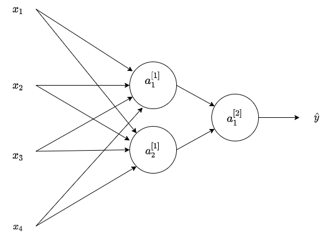

# **Shallow Neural Networks**

## **Congratulations! You passed!**

### **Grade received** 80%

### **Latest Submission Grade** 80%

### **To pass** 80% or higher

---

1. Which of the following are true? (Check all that apply.)

   - [x]  $a^{[2]}$ denotes the activation vector of the second layer.
   - [ ]  $a^{[3](2)}$ denotes the activation vector of the second layer for the third example.
   - [ ]  $a^{[3]}_{3}$ denotes the activation vector of the second layer for the third example.
   - [x]  $w^{[4]}_{3}$ is the column vector of parameters of the fourth layer and third neuron.  
   - [ ]  $w^{[4]}_{3}$ is the column vector of parameters of the third layer and fourth neuron.
   - [ ]  $w^{[4]}_{3}$ is the row vector of parameters of the fourth layer and third neuron.
    > <spane style="color: green;">**Correct** Great, you got all the right answers.

---

2. The tanh activation is not always better than sigmoid activation function for hidden units because the mean of its output is closer to zero, and so it centers the data, making learning complex for the next layer. True/False?

    - [ ] True
    - [x] False
    > <spane style="color: green;">**Correct** Yes. As seen in lecture the output of the tanh is between -1 and 1, it thus centers the data which makes the learning simpler for the next layer.

---

3. Which of the following is a correct vectorized implementation of forward propagation for layer 2?

    - [ ] $Z^{[1]} = W^{[1]} \, X + b^{[1]}$ $A^{[1]} = g^{[1]}(Z^{[1]})$
    - [ ] $Z^{[2]} = W^{[2]} \, X + b^{[2]}$ $A^{[2]} = g^{[2]}(Z^{[2]})$
    - [x] $Z^{[2]} = W^{[2]} \, A^{[1]} + b^{[2]}$ $A^{[2]} = g^{[2]}(Z^{[2]})$
    - [ ] $Z^{[2]} = W^{[2]} \, A^{[1]} + b^{[2]}$ $A^{[2]} = g(Z^{[2]})$
    > <spane style="color: green;">**Correct** Yes. The elements of layer two are represented using a superscript in brackets.

---

4. When building a binary classifier for recognizing cats (y=1) vs raccoons (y=0). Is better to use the sigmoid function as activation function for the hidden layers. True/False

    - [x] False
    - [ ] True
    > **Incorrect**. Using tanh almost always works better than the sigmoid function for hidden layers

---

5. Consider the following code:

    A = np.random.randn(4,3)

    B = np.sum(A, axis = 1, keepdims = True) 

    What will be B.shape? (If you’re not sure, feel free to run this in python to find out).

    - [ ] (3,)
    - [ ] (4,)
    - [ ] (1,3)
    - [x] (4,1)
    > <spane style="color: green;">**Correct** Yes, we use (keepdims = True) to make sure that A.shape is (4,1) and not (4, ). It makes our code more robust.

---

6. Suppose you have built a neural network with one hidden layer and tanh as activation function for the hidden layers. Which of the following is a best option to initialize the weights?

    - [ ] Initialize the weights to large random numbers.
    - [x] Initialize the weights to small random numbers.
    - [ ] Initialize all weights to 0.
    - [ ] Initialize all weights to a single number chosen randomly.
    > <spane style="color: green;">**Correct** The use of random numbers helps to "break the symmetry" between all the neurons allowing them to compute different functions. When using small random numbers the values $z^{[k]}$ will be close to zero thus the activation values will have a larger gradient speeding up the training process.

---

7. A single output and single layer neural network that uses the sigmoid function as activation is equivalent to the logistic regression. True/False

    - [ ] False
    - [x] True

    > **Incorrect**. The logistic regression model can be expressed by $\hat{y} = \sigma(Wx+b)$ This is the same as $a^{[1]} = \sigma(W^{[1]}X+b)$.

---

8. Which of the following are true about the tanh function?

    - [ ] The slope is zero for negative values.
    - [x] For large values the slope is close to zero.
    - [x] The tanh is mathematically a shifted version of the sigmoid function.
    - [ ] The derivative at $c = 0$ is not well defined.
    - [ ] For large values the slope is larger.
    > <spane style="color: green;">**Correct** Great, you got all the right answers.

---

9. Consider the following 1 hidden layer neural network:

    

    Which of the following statements are True? (Check all that apply).

   - [ ] $W^{[2]}$ will have shape (2, 1)
   - [x] $W^{[2]}$ will have shape (1, 2)
   - [ ] $b^{[1]}$ will have shape (4, 2)
   - [x] $b^{[1]}$ will have shape (2, 1)
   - [ ] $W^{[1]}$ will have shape (4, 2)
   - [x] $W^{[1]}$ will have shape (2, 4)
    > <spane style="color: green;">**Correct** Great, you got all the right answers.

---

10. Consider the following 1 hidden layer neural network:

    

    What are the dimensions of $Z^{[1]}$ and $A^{[1]}$ ?

    - [ ] $Z^{[1]}$ and $A^{[1]}$ are (4,m)
    - [ ] $Z^{[1]}$ and $A^{[1]}$ are (4,1)
    - [x] $Z^{[1]}$ and $A^{[1]}$ are (2,m)
    - [ ] $Z^{[1]}$ and $A^{[1]}$ are (2,1)
    > <spane style="color: green;">**Correct** Yes. The $Z^{[1]}$ and $A^{[1]}$ are calculated over a batch of training examples. The number of columns in $Z^{[1]}$ and $A^{[1]}$ is equal to the number of examples in the batch, m. And the number of rows in $Z^{[1]}$ and $A^{[1]}$ is equal to the number of neurons in the first layer.
