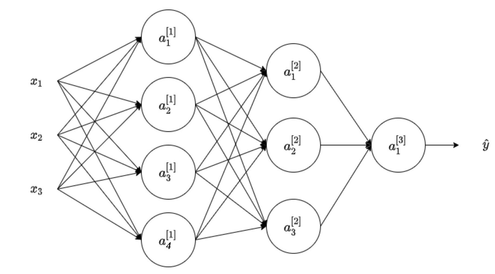

# **Key Concepts on Deep Neural Networks**

## **Congratulations! You passed!**

### **Grade received** 80%

### **Latest Submission Grade** 80%

### **To pass** 80% or higher

---

1. What is the "cache" used for in our implementation of forward propagation and backward propagation?

   - [ ]  It is used to cache the intermediate values of the cost function during training.
   - [ ]  We use it to pass variables computed during backward propagation to the corresponding forward propagation step. It contains useful values for forward propagation to compute activations.
   - [x]  We use it to pass $Z$ computed during forward propagation to the corresponding backward propagation step. It contains useful values for backward propagation to compute derivatives.
   - [ ]  It is used to keep track of the hyperparameters that we are searching over, to speed up computation.  

   > ✔ <spane style="color: green;">**Correct** Correct, the "cache" records values from the forward propagation units and are used in backward propagation units because it is needed to compute the chain rule derivatives.

---

2. During the backpropagation process, we use gradient descent to change the hyperparameters. True/False?

    - [ ] True
    - [x] False

    > ✔ <spane style="color: green;">**Correct** Correct. During backpropagation, we use gradient descent to compute new values of $W^{[l]}$ and $b^{[l]}$. These are the parameters of the network.

---

3. Which of the following statements is true?

    - [x] The deeper layers of a neural network are typically computing more complex features of the input than the earlier layers.
    - [ ] The earlier layers of a neural network are typically computing more complex features of the input than the deeper layers.

    > ✔ <spane style="color: green;">**Correct** 

---

4. Vectorization allows you to compute forward propagation in an $L$-layer neural network without an explicit for-loop (or any other explicit iterative loop) over the layers l=1, 2, …,L. True/False?

    - [x] True
    - [ ] False

    > ✖️ **Incorrect**. Forward propagation propagates the input through the layers, although for shallow networks we may just write all the lines $(a^{[2]}=g^{[2]}(z^{[2]}), z^{[2]}=W^{[2]}a^{[1]}+b^{[2]}, \cdots)$ in a deeper network, we cannot avoid a for loop iterating over the layers: $(a^{[l]}=g^{[l]}(z^{[l]}), z^{[l]}=W^{[l]}a^{[l-1]}+b^{[l]}, \cdots)$

---

5. Assume we store the values for $n^{[l]}$ in an array called layer_dims, as follows: $layer_dims = [n_{x} , 4,3,2,1]$. So layer 1 has four hidden units, layer 2 has 3 hidden units and so on. Which of the following for-loops will allow you to initialize the parameters for the model?

    - [x] for i in range(1, len(layer_dims)): parameter['W' + str(i)] = np.random.randn(layer_dims[i], layer_dims[i-1]) * 0.01 parameter['b' + str(i)] = np.random.randn(layer_dims[i], 1) * 0.01
    - [ ] for i in range(1, len(layer_dims)): parameter['W' + str(i)] = np.random.randn(layer_dims[i-1], layer_dims[i]) * 0.01 parameter['b' + str(i)] = np.random.randn(layer_dims[i], 1) * 0.01
    - [ ] for i in range(1, len(layer_dims)/2): parameter['W' + str(i)] = np.random.randn(layer_dims[i], layer_dims[i-1]) * 0.01 parameter['b' + str(i)] = np.random.randn(layer_dims[i], 1) * 0.01
    - [ ] for i in range(1, len(layer_dims)/2): parameter['W' + str(i)] = np.random.randn(layer_dims[i], layer_dims[i-1]) * 0.01 parameter['b' + str(i)] = np.random.randn(layer_dims[i-1], 1) * 0.01

    > ✔ <spane style="color: green;">**Correct** 

---

6. Consider the following neural network.
    
    How many layers does this network have?

    - [ ] The number of layers $L$ is 4. The number of hidden layers is 4.
    - [ ] The number of layers $L$ is 5. The number of hidden layers is 4.
    - [x] The number of layers $L$ is 4. The number of hidden layers is 3.
    - [ ] The number of layers $L$ is 3. The number of hidden layers is 3.

    > ✔ <spane style="color: green;">**Correct** Yes. As seen in lecture, the number of layers is counted as the number of hidden layers + 1. The input and output layers are not counted as hidden layers.

---

7. During forward propagation, in the forward function for a layer $l$ you need to know what is the activation function in a layer (sigmoid, tanh, ReLU, etc.). During backpropagation, the corresponding backward function also needs to know what is the activation function for layer $l$, since the gradient depends on it. True/False?

    - [x] True
    - [ ] False

    > ✔ <spane style="color: green;">**Correct** Yes, as you've seen in week 3 each activation has a different derivative. Thus, during backpropagation you need to know which activation was used in the forward propagation to be able to compute the correct derivative.

---

8. There are certain functions with the following properties: 

    (i) To compute the function using a shallow network circuit, you will need a large network (where we measure size by the number of logic gates in the network), but (ii) To compute it using a deep network circuit, you need only an exponentially smaller network. True/False?

    - [x] True
    - [ ] False

    > ✔ <spane style="color: green;">**Correct** 

---

9. Consider the following 2 hidden layers neural network:

    

    Which of the following statements is true? (Check all that apply).

   - [ ] $W^{[2]}$ will have shape (1, 3)
   - [x] $b^{[1]}$ will have shape (4, 1)
   - [x] $W^{[1]}$ will have shape (4, 3)
   - [ ] $b^{[1]}$ will have shape (3, 1)
   - [ ] $W^{[1]}$ will have shape (3, 4)
   - [x] $W^{[2]}$ will have shape (3, 4)
   - [ ] $b^{[1]}$ will have shape (1, 4)
   - [ ] $W^{[2]}$ will have shape (3, 1)
   - [ ] $W^{[2]}$ will have shape (4, 3)

    > ✔ <spane style="color: green;">**Correct** Great, you got all the right answers.

---

10. In the general case if we are training with $m$ examples what is the shape of $A^{[l]}$

    - [x] $(m, n^{[l]})$
    - [ ] $(n^{[l+1]}, m)$
    - [ ] $(m, n^{[l+1]})$
    - [ ] $(n^{[l]}, m)$

    > ✖️ **Incorrect**. No. The number of columns corresponds to the number of training examples $m$
