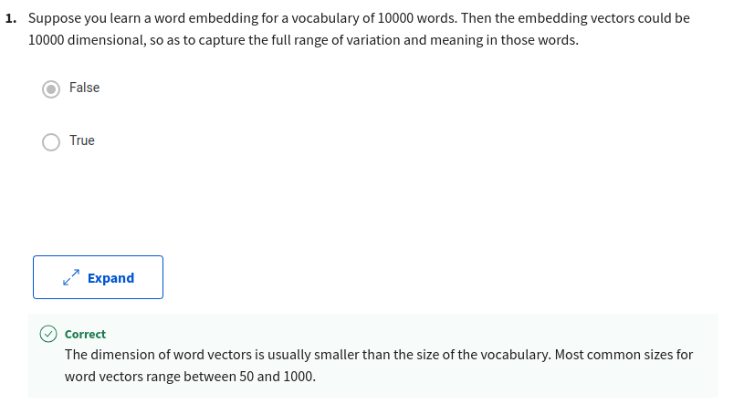
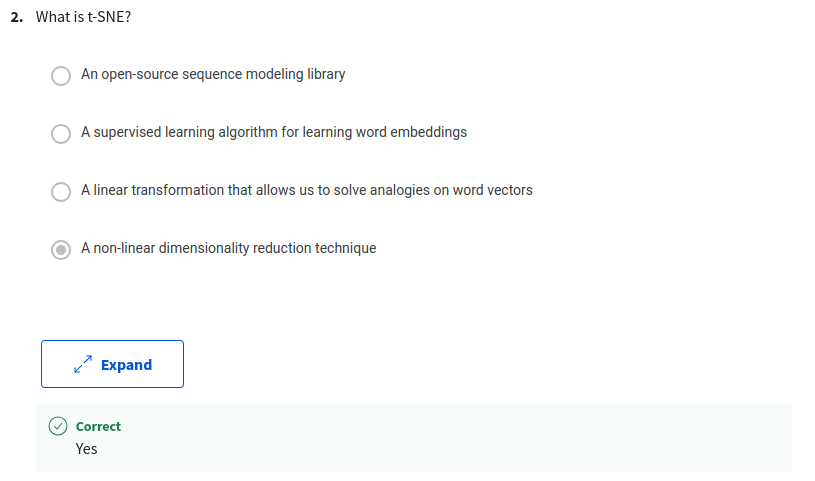
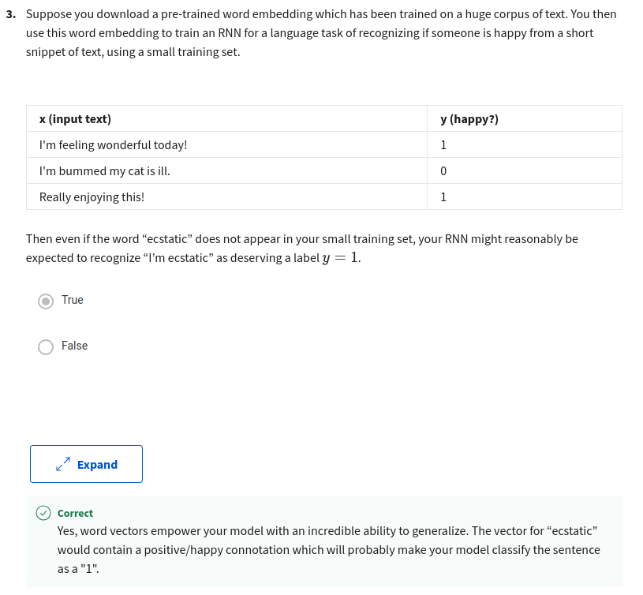
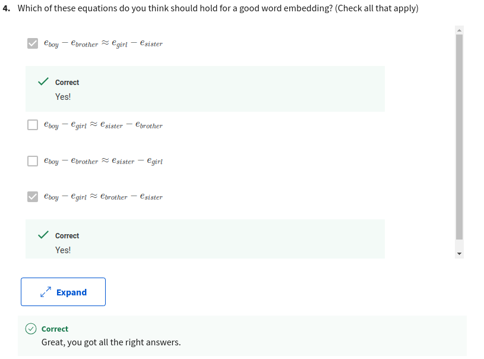
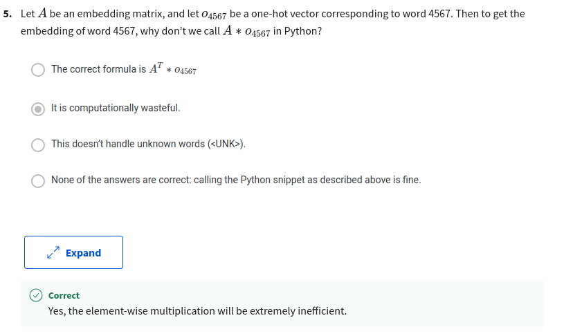
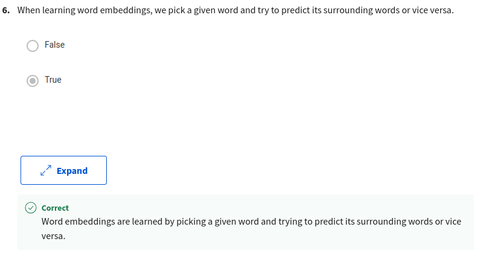
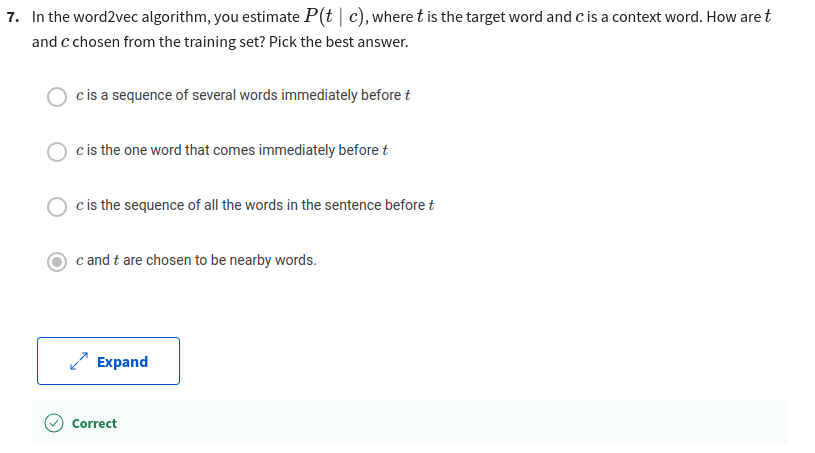
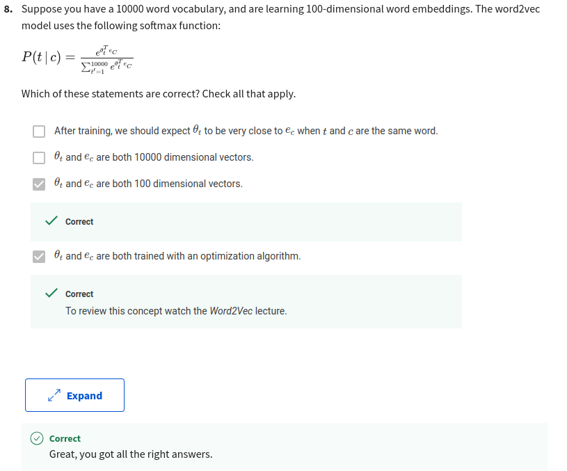
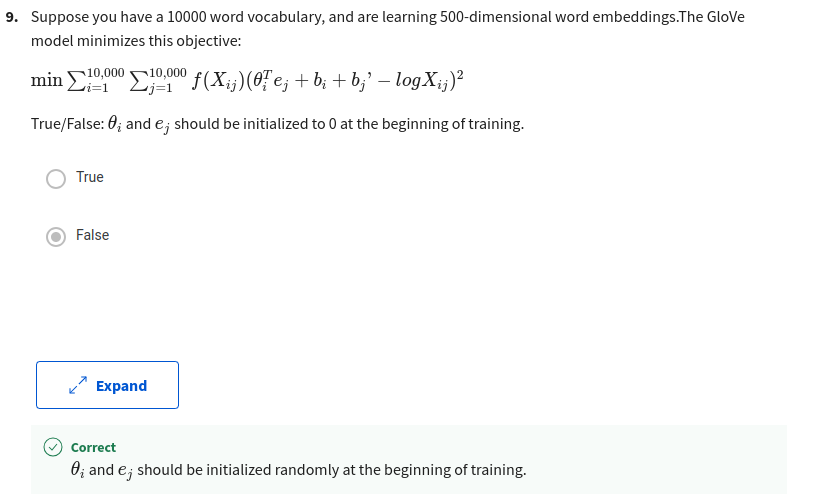
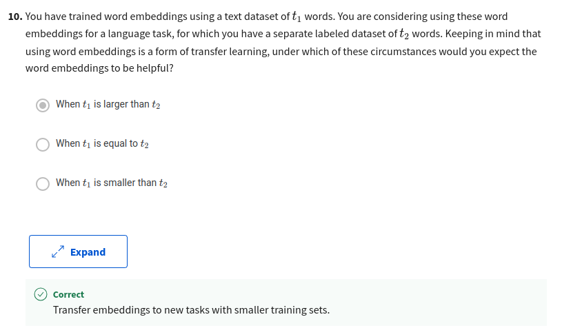

# ** Recurrent Neural Networks**

## **Congratulations! You passed!**

### **Grade received** 100%

### **Latest Submission Grade** 100%

### **To pass** 80% or higher

---

1. 

---

2. 

---

3. 

---

4. 

---

5. 

---

6. 

---

7. 

---

8. 

---

9. 

---

10. 

